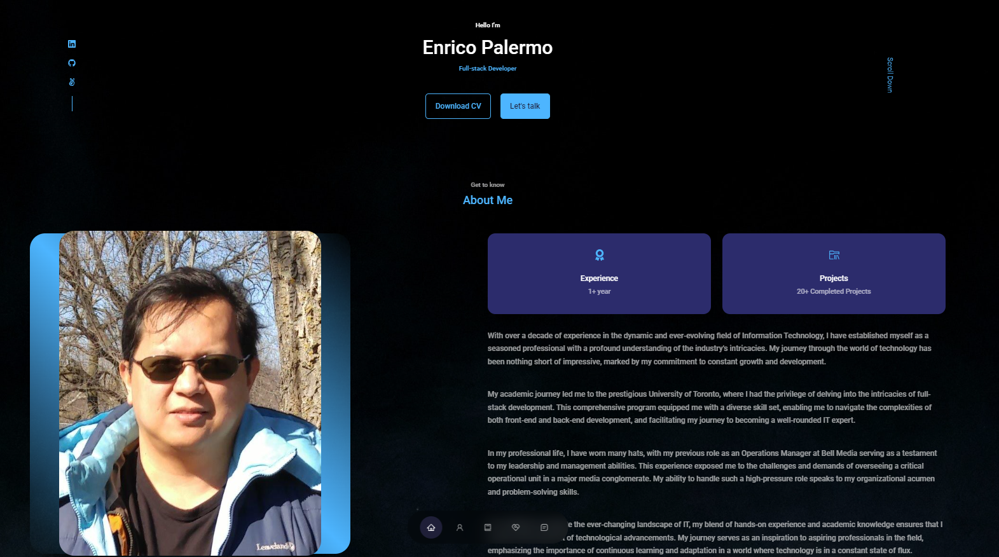

# Personal-Portfolio

> This is personal portfolio website.



## Built With

- React
- CSS
- VS code

## Live Demo

- [Live Demo](https://earnest-fairy-c7ee29.netlify.app/)

# Getting Started

## Prerequisites:

- Create an account on github

- Install gitbash or use git on the command line.

- Use an IDE of your preference such as VScode.

## Steps to follow:

- Choose a folder in your local machine where you want this repository to be copied

- Clone this [repository](https://github.com/epalermobootcamp/Portfolio) to your local machine
- ```
  git clone https://github.com/epalermobootcamp/Portfolio
  ```

- Navigate to `cd Portfolio` directory.

- To install all the app dependencies on the command line run
- ```
  npm install
  ```
- To run app in the development mode run
- ```
  npm start
  ```

## Author

**Enrico Palermo**

- [GitHub](https://github.com/epalermobootcamp)
- [LinkedIn](https://www.linkedin.com/in/enrico-palermo-12bb8162/)

## Contributing

- Contributions, issues, and feature requests are welcome!
- Feel free to check the [issues page](https://github.com/epalermobootcamp/Portfolio/issues).

# Show your support

Give a ⭐ if you like this project!

# Acknowledgments
